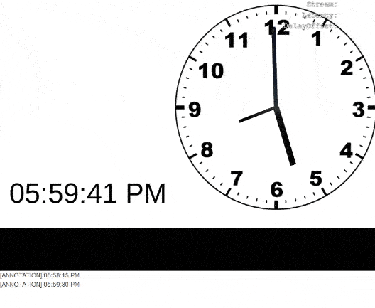

# 03 - Annotations and Notifications
Example showing how to use annotations and notifications and illustrates the difference between them. 

Data streams are excellent for frequent data transmission where speed and smoothness are  priorities, such as the position of player characters on the map. These advantages come at the cost of unrealiable transmission as **sent data might sometimes be dropped** and will never arrive to the user.

To send data that *must* arrive to the user, such as a end-of-match event or the opening of a user poll, an annotation or notification is preferred. These are marginally slower than data streams, but will always arrive to the player. Notifications will arrive **as soon as possible** and are ideal for notifying the user of events such as the opening a user poll or a text message. On the other hand, annotations are best used for time-sensitive events as they will arrive **synchronized to the video stream**. This makes them ideal for when we want something to happen in the web view at the same time as in-game event, like for example triggering an animation when the match ends.

This example illustrates the difference between annotations and notifications via a clock. Note that notifcation will always arrive a bit before the annotation, as it tries to arrive as soon as possible. On the other hand, the annotation will always arrive synchronized to the stream clock. You can test this behaviour further by modifying the "Delay" parameter in Genvid Unity window.



## Relevant Unity Files
* **SampleScene:** Basic scene that contains a clock built with a sprite and cube primitives as the clock hands, with a TextMeshPro object to show the exact time. The "GenvidSessionManager" prefab has also been added and correctly set-up. The "GenvidStreams" child object has been configured to send two streams named "annotation" and "notification" as defined in the `ClockStreams.cs` component.
* **Clock.cs:** Script that moves the clock arms and set the time text according to the local system clock.
* **ClockStream.cs:** Script with code to sent notifications and annotations every 15 seconds.

## Relevant Web View Code
The following `<p>` tag is added right after the video stream:
```html
<div id="video_player"></div>
<p id="myLog"></p>
```
This code is used for printing each annotation:
```typescript
private on_new_frame(frameSource: genvid.IDataFrame) {
    if (frameSource.annotations.annotation && frameSource.annotations.annotation.length != 0) {
        let annotation = JSON.parse(genvid.UTF8ToString(frameSource.annotations.annotation[0].rawdata);
        this.myLog.innerHTML += `[ANNOTATION] ${annotation.Content} <br>`;
    }
    ...
```
And this is used for each notification:
```typescript
private on_notifications_received(message: genvid.IDataNotifications) {
    ...
         else if (notification.id === "notification") {
            let notificationData = JSON.parse(notification.data);
            this.myLog.innerHTML += `[NOTIFICATION] ${notificationData.Content}<br />`;
         }
     }
}    
```