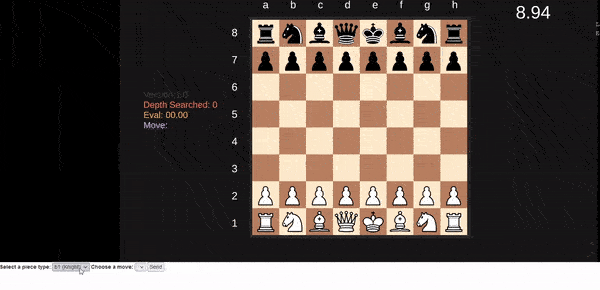

# 06 - Chess Game
Complex example that shows a chess game against an AI where players can vote for the moves White will execute. Built upon [SebLague's Chess AI](https://github.com/SebLague/Chess-AI) for Unity.



## Relevant Configuration Files
* **GenvidServices/config/events.json:** Contains the definition of event we send from the web view to the game.

## Relevant Unity Files
* **Chess:** Base chess scene. The "GenvidSessionManager" prefab has been added and correctly set-up, and has the addtional components added. The child objects "Genvid Streams" and "GenvidEvents" have been configured with the corresponding actions.
* **GenvidChessManager.cs:** Main script that handles the game loop. Sends a list of valid moves to the web view when a vote starts and executes the most voted move when the time is over.
* **GenvidVoteEventHandler.cs:** Handles saving the recieved votes and returing the most voted one when required by GenvidChessManager.
* **HumanPlayer.cs:** Script from original ChessAI that was modified to allow control via Genvid.

## Relevant Web View Code
We define an interface to recieve moves from Unity:
```typescript
export interface ILegalMove {
    Piece: string;
    StartSquare: string;
    MoveName: string;
}
```
The following properties are added to the UnityController class:
```typescript
voteActiveDiv: HTMLDivElement;
voteIdleDiv: HTMLDivElement;

pieceSelect: HTMLSelectElement;
moveSelect: HTMLSelectElement;

legalMoves: ILegalMove[] = [];
```
Each time we get the moves from a new vote starting we loop through them and modify the dropdowns accordingly:
```typescript
if (frameSource.annotations.voteStart && frameSource.annotations.voteStart.length != 0) {
    const moves = JSON.parse(genvid.UTF8ToString(frameSource.annotations.voteStart[0].rawdata));
    this.legalMoves = moves.LegalMoves;
    $("#pieces_select").empty();
    
    // We keep the start square here to make sure we don't add duplicates.
    let duplicateList = [];
    this.legalMoves.forEach(piece => {
        if (duplicateList.indexOf(piece.StartSquare) == -1) {
            duplicateList[duplicateList.length] = piece.StartSquare;
            this.pieceSelect.options[this.pieceSelect.options.length] 
                = new Option(`${piece.StartSquare} (${piece.Piece})`, piece.StartSquare);
        }
    });
    
    this.voteActiveDiv.style.visibility = "visible";
    this.voteIdleDiv.style.visibility = "hidden";
}
```
The dropwdown have events to update themselves and send the move when the vote button is pressed.
```typescript
this.voteActiveDiv = <HTMLDivElement> document.querySelector("#voting_active");
this.voteIdleDiv = <HTMLDivElement> document.querySelector("#voting_idle");
this.pieceSelect = <HTMLSelectElement> document.querySelector("#pieces_select");
this.moveSelect = <HTMLSelectElement> document.querySelector("#move_select");

// When the player selects a piece we update the move selection appropiately.
this.pieceSelect.addEventListener('change', () => {
    $("#move_select").empty();
    this.legalMoves.forEach(move => {
        if (move.StartSquare == this.pieceSelect.value)
            this.moveSelect[this.moveSelect.length] 
                = new Option(move.MoveName, move.MoveName);
    });
});

document.querySelector("#send_move_button").addEventListener('click', () => {
    this.client.sendEventObject({'vote': this.moveSelect.value});
    
    this.voteActiveDiv.style.visibility = "hidden";
    this.voteIdleDiv.style.visibility = "visible";
});

this.voteActiveDiv.style.visibility = "hidden";
```