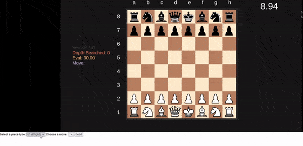

# genvid-unity-examples
Collection of examples developed using the Genvid SDK for Unity.

## How to run
*Coming soon...*

## Examples
### 01 - Data Streams 
Basic examples that contains a rotating cube. Demostrates how to set up a scene and send data about the cube to a Genvid stream via data streams, to then display them in web view.

### 02 - Web View Interaction
Example of how to add interaction to the web view based on information sent from Unity. The sample displays a map and sends a data stream with the bounding box corresponding to each location. The web view user can click on one of these locations to see detailed information.

### 03 - Annotations and Notifications
Example showing how to use annotations and notifications and illustrates the difference between them.  Check out the corresponding readme for the explanation.

### 04 - Events and Commands
Example that shows how to send player input from the web view to the game via events and commands.

### 06 - Chess Game
Complex example that shows a chess game against an AI where players can vote for the moves White will execute. Built upon [SebLague's Chess AI](https://github.com/SebLague/Chess-AI) for Unity.

## FAQ
*Coming soon...*
