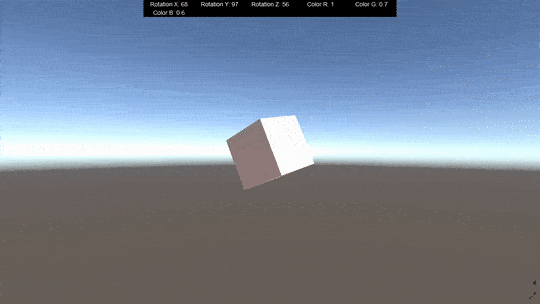
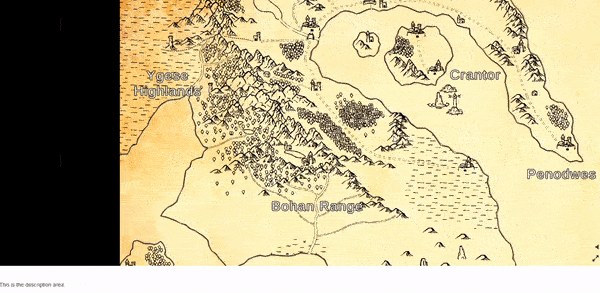

# genvid-unity-examples
Collection of examples developed using the Genvid SDK for Unity.

## How to run
*Coming soon...*

## Examples
### 01 - Data Streams 
Basic examples that contains a rotating cube. Demostrates how to set up a scene and send data about the cube to a Genvid stream via data streams, to then display them in web view.

### 02 - Web View Interaction
Example of how to add interaction to the web view based on information sent from Unity. The sample displays a map and sends a data stream with the bounding box corresponding to each location. The web view user can click on one of these locations to see detailed information.

## FAQ
*Coming soon...*
